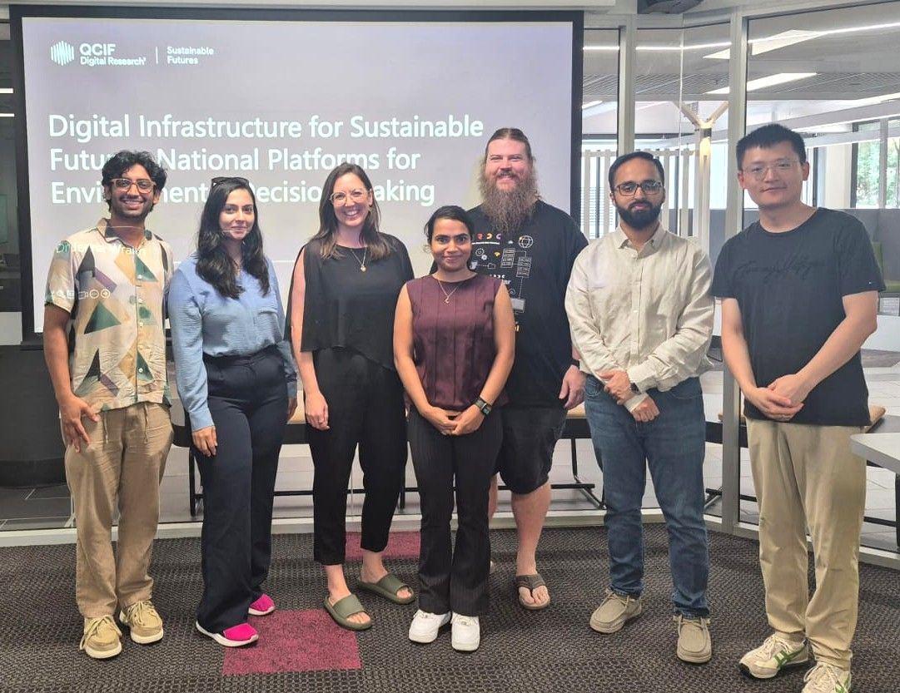
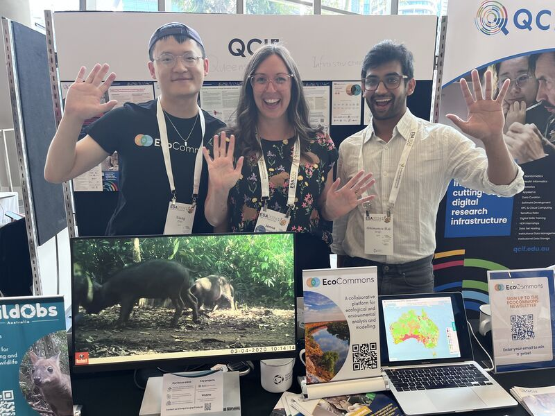
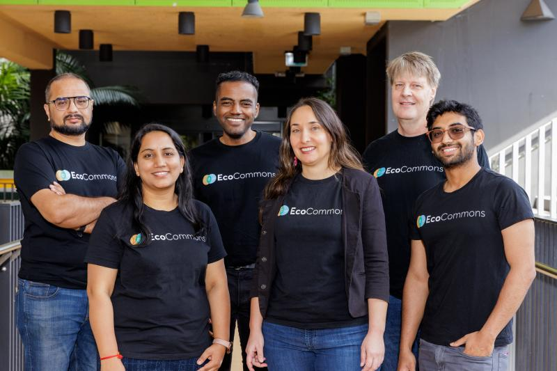
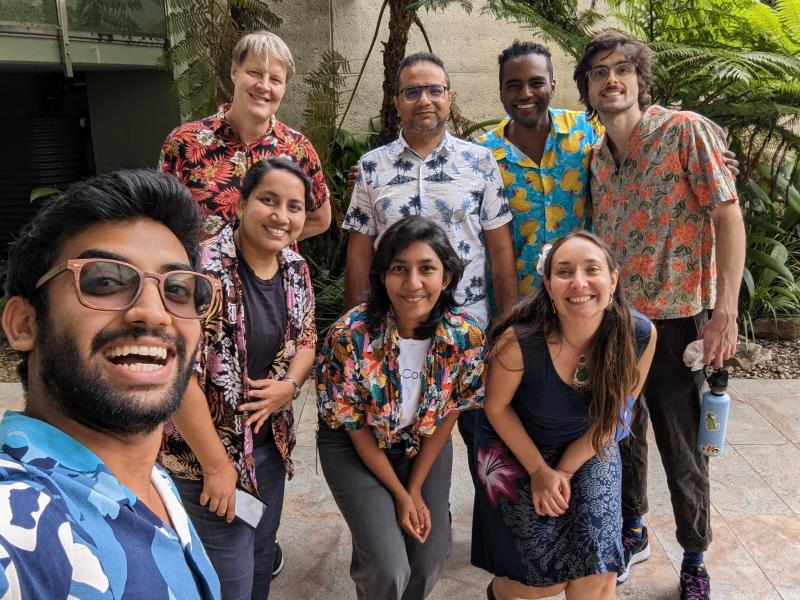
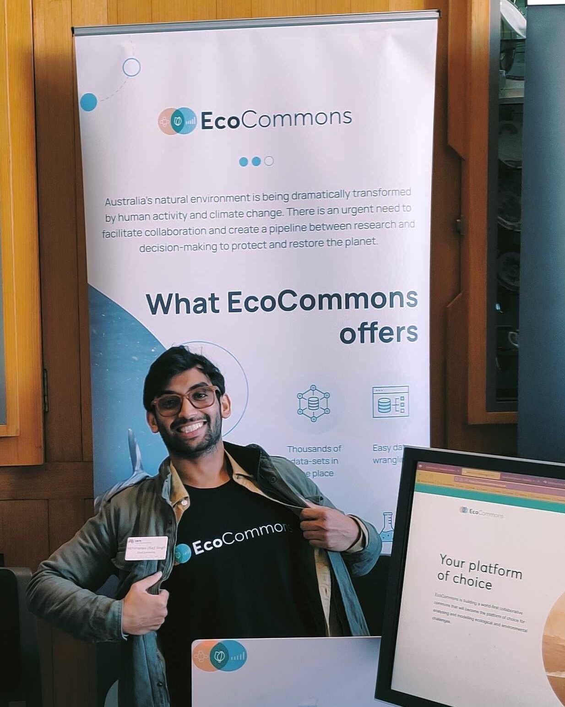

```{=html}
<section class="name-banner" aria-label="Name and headshot">
  
  <h1>Abhimanyu Raj Singh <em>Chandel</em></h1>
</section>

<nav class="tab-nav" aria-label="Sections">
  <button class="tab-btn is-active" type="button" data-tab="timeline">Timeline Resume</button>
  <button class="tab-btn" type="button" data-tab="blogs">Idea-Blogs</button>
  <button class="tab-btn" type="button" data-tab="contact">Contact</button>
</nav>

<section class="tab-panel is-active" id="panel-timeline" data-panel="timeline">
  <section class="intro-card" aria-label="Profile summary">
    <h2>Profile</h2>
    <p>
      Organised and self-motivated environmental science professional focused on biodiversity
      conservation, climate adaptation, and practical ecological modelling. Currently working with
      QCIF as a Data Ecologist (2026), I work across field and analytical contexts to convert
      ecological data into decisions that support restoration, resilience, and community outcomes.
    </p>
  </section>

  <section class="dneg-wrap" aria-label="Timeline Resume">
    <aside class="dneg-rail" aria-label="Timeline years">
      <button class="dneg-year is-active" data-target="y-2026" type="button">2026</button>
      <button class="dneg-year" data-target="y-2024" type="button">2024</button>
      <button class="dneg-year" data-target="y-2023" type="button">2023</button>
      <button class="dneg-year" data-target="y-2022" type="button">2022</button>
      <button class="dneg-year" data-target="y-2021" type="button">2021</button>
      <button class="dneg-year" data-target="y-2020" type="button">2020</button>
      <button class="dneg-year" data-target="y-2019" type="button">2019</button>
    </aside>

    <main class="dneg-content" id="timeline">
      <section class="dneg-year-block" id="y-2026" data-year="2026">
        <div class="dneg-divider"><span class="dneg-divider-line"></span><span class="dneg-divider-year">2026</span><span class="dneg-divider-line"></span></div>
        <article class="dneg-card dneg-card-clickable" data-detail="detail-2026" role="button" tabindex="0" aria-controls="detail-2026" aria-label="Open 2026 details">
          <div class="dneg-media"></div>
          <div class="dneg-copy">
            <h3>🧠 Data Ecologist, QCIF Sustainable Futures</h3>
            <p class="dneg-kicker">2026 - Present</p>
            <p>Continuing with QCIF to deliver ecological data analysis, modelling workflows, and decision-support outputs for conservation and climate resilience.</p>
          </div>
        </article>
      </section>

      <section class="dneg-year-block" id="y-2024" data-year="2024">
        <div class="dneg-divider"><span class="dneg-divider-line"></span><span class="dneg-divider-year">2024</span><span class="dneg-divider-line"></span></div>
        <article class="dneg-card dneg-card-clickable" data-detail="detail-2024" role="button" tabindex="0" aria-controls="detail-2024" aria-label="Open 2024 details">
          <div class="dneg-media"></div>
          <div class="dneg-copy">
            <h3>💻 User Support Analyst, EcoCommons/BCCVL (Part-time)</h3>
            <p class="dneg-kicker">Jan 2024 - Mar 2024</p>
            <p>Supported users, tested workflows, and improved usability for ecological modelling and climate scenario tools.</p>
          </div>
        </article>
      </section>

      <section class="dneg-year-block" id="y-2023" data-year="2023">
        <div class="dneg-divider"><span class="dneg-divider-line"></span><span class="dneg-divider-year">2023</span><span class="dneg-divider-line"></span></div>
        <article class="dneg-card dneg-card-clickable" data-detail="detail-2023" role="button" tabindex="0" aria-controls="detail-2023" aria-label="Open 2023 details">
          <div class="dneg-media"></div>
          <div class="dneg-copy">
            <h3>🔬 Functional Ecology Analyst, QCIF Sustainable Futures</h3>
            <p class="dneg-kicker">2023 - Present</p>
            <p>Developing plant trait-environment models using AusTraits data for conservation and climate resilience decisions.</p>
          </div>
        </article>
      </section>

      <section class="dneg-year-block" id="y-2022" data-year="2022">
        <div class="dneg-divider"><span class="dneg-divider-line"></span><span class="dneg-divider-year">2022</span><span class="dneg-divider-line"></span></div>
        <article class="dneg-card dneg-card-clickable" data-detail="detail-2022" role="button" tabindex="0" aria-controls="detail-2022" aria-label="Open 2022 details">
          <div class="dneg-media"></div>
          <div class="dneg-copy">
            <h3>🧭 Field Officer, BUSH-IT</h3>
            <p class="dneg-kicker">Jan 2022 - Dec 2022</p>
            <p>Conducted ecological surveys, installed remote cameras, and assisted restoration projects across Queensland.</p>
          </div>
        </article>
      </section>

      <section class="dneg-year-block" id="y-2021" data-year="2021">
        <div class="dneg-divider"><span class="dneg-divider-line"></span><span class="dneg-divider-year">2021</span><span class="dneg-divider-line"></span></div>
        <article class="dneg-card dneg-card-clickable" data-detail="detail-2021" role="button" tabindex="0" aria-controls="detail-2021" aria-label="Open 2021 details">
          <div class="dneg-media"></div>
          <div class="dneg-copy">
            <h3>🛠️ Environmental Field Technician, SERS</h3>
            <p class="dneg-kicker">Aug 2020 - Apr 2021</p>
            <p>Installed and maintained environmental monitoring systems and supported reporting datasets for councils and projects.</p>
          </div>
        </article>
      </section>

      <section class="dneg-year-block" id="y-2020" data-year="2020">
        <div class="dneg-divider"><span class="dneg-divider-line"></span><span class="dneg-divider-year">2020</span><span class="dneg-divider-line"></span></div>
        <article class="dneg-card dneg-card-clickable" data-detail="detail-2020" role="button" tabindex="0" aria-controls="detail-2020" aria-label="Open 2020 details">
          <div class="dneg-media"></div>
          <div class="dneg-copy">
            <h3>🎓 Master's Coursework and Volunteer Ecology Work</h3>
            <p class="dneg-kicker">2020 - 2022</p>
            <p>Completed environmental science training and supported bushcare, climate engagement, and citizen-science activities.</p>
          </div>
        </article>
      </section>

      <section class="dneg-year-block" id="y-2019" data-year="2019">
        <div class="dneg-divider"><span class="dneg-divider-line"></span><span class="dneg-divider-year">2019</span><span class="dneg-divider-line"></span></div>
        <article class="dneg-card dneg-card-clickable" data-detail="detail-2019" role="button" tabindex="0" aria-controls="detail-2019" aria-label="Open 2019 details">
          <div class="dneg-media"></div>
          <div class="dneg-copy">
            <h3>📘 Transition into Environmental Science Pathway</h3>
            <p class="dneg-kicker">2019</p>
            <p>Began focused transition toward applied ecology, environmental protection, and climate adaptation career goals.</p>
          </div>
        </article>
      </section>
    </main>
  </section>

  <section class="content-card" aria-label="Skills and projects">
    <h2>Skills, Projects, and Interests</h2>
    <div class="skills-cloud" aria-label="Skills">
      <span class="skill-pill">Ecological Modelling (R/Python)</span>
      <span class="skill-pill">Spatial Analysis (GIS)</span>
      <span class="skill-pill">Field Survey Design</span>
      <span class="skill-pill">Conservation Planning</span>
      <span class="skill-pill">Data Visualisation</span>
      <span class="skill-pill">Reproducible Workflows</span>
      <span class="skill-pill">User Training and Support</span>
      <span class="skill-pill">Scientific Writing</span>
      <span class="skill-pill">Automation Testing</span>
      <span class="skill-pill">Stakeholder Communication</span>
    </div>

    <div class="spotlight-grid">
      <article class="spotlight-card">
        <h4>Highlighted Projects</h4>
        <ul>
          <li>Plant trait-environment modelling with AusTraits for conservation decisions.</li>
          <li>Government and research use-case support across ACT/QLD/NSW workflows.</li>
          <li>Community restoration and biodiversity monitoring in Queensland and NSW.</li>
        </ul>
      </article>
      <article class="spotlight-card">
        <h4>Interests</h4>
        <ul>
          <li>Ecology engineering and invasive species management.</li>
          <li>Climate adaptation, habitat restoration, and decision support systems.</li>
          <li>Science communication, outreach, and practical conservation training.</li>
        </ul>
      </article>
    </div>
  </section>

  <footer class="button-container bottom-links" aria-label="External links">
    <a class="download-button" href="resume.pdf">Download Resume</a>
    <a class="download-button" href="https://www.ecocommons.org.au">Project Website</a>
    <a class="download-button" href="https://github.com/abhirscecocommons">Github</a>
    <a class="download-button" href="https://www.sciencedirect.com/science/article/pii/S1364815224003165">Recent Publication</a>
  </footer>
</section>

<section class="tab-panel" id="panel-blogs" data-panel="blogs">
  <section class="content-card">
    <h2>Idea-Blogs</h2>
    <p>Add files like <code>idea-pages/page2.txt</code>, <code>idea-pages/page3.txt</code>, then render. They will auto-appear here.</p>
    <iframe class="blog-frame" src="_generated/idea-blogs.html" title="Idea blog pages"></iframe>
  </section>
</section>

<section class="tab-panel" id="panel-contact" data-panel="contact">
  <section class="content-card">
    <h2>Contact</h2>
    <p>Send a quick enquiry. This opens your email app and prepares a message to <strong>abhirsc@outlook.com</strong>.</p>

    <form id="contact-form" class="contact-form" novalidate>
      <label for="contact-name">Name</label>
      <input id="contact-name" name="name" type="text" required />

      <label for="contact-email">Email</label>
      <input id="contact-email" name="email" type="email" required />

      <label for="contact-subject">Subject</label>
      <input id="contact-subject" name="subject" type="text" placeholder="General enquiry" />

      <label for="contact-message">Message</label>
      <textarea id="contact-message" name="message" rows="6" required></textarea>

      <button class="download-button" type="submit">Send Enquiry</button>
    </form>
  </section>
</section>

<div id="detail-2026" class="detail-modal" onclick="closeDetailModal('detail-2026', event)">
  <div class="detail-panel" role="dialog" aria-modal="true" aria-labelledby="detail-title-2026">
    <button class="detail-close" type="button" onclick="forceCloseDetailModal('detail-2026')" aria-label="Close details">&times;</button>
    <h3 id="detail-title-2026">🧠 Data Ecologist, QCIF Sustainable Futures</h3>
    <p class="dneg-kicker">2026 - Present</p>
    <p>Still working with QCIF as a Data Ecologist, with focus on reproducible ecological modelling, spatial analysis, and translating complex environmental datasets into actionable conservation insights.</p>
  </div>
</div>

<div id="detail-2024" class="detail-modal" onclick="closeDetailModal('detail-2024', event)">
  <div class="detail-panel" role="dialog" aria-modal="true" aria-labelledby="detail-title-2024">
    <button class="detail-close" type="button" onclick="forceCloseDetailModal('detail-2024')" aria-label="Close details">&times;</button>
    <h3 id="detail-title-2024">💻 User Support Analyst, EcoCommons/BCCVL</h3>
    <p class="dneg-kicker">Jan 2024 - Mar 2024</p>
    <p>Delivered user support and training across ecological modelling workflows, tested platform features, and assisted scenario-based analyses for biodiversity and climate change applications.</p>
  </div>
</div>

<div id="detail-2023" class="detail-modal" onclick="closeDetailModal('detail-2023', event)">
  <div class="detail-panel" role="dialog" aria-modal="true" aria-labelledby="detail-title-2023">
    <button class="detail-close" type="button" onclick="forceCloseDetailModal('detail-2023')" aria-label="Close details">&times;</button>
    <h3 id="detail-title-2023">🔬 Functional Ecology Analyst, QCIF Sustainable Futures</h3>
    <p class="dneg-kicker">2023 - Present</p>
    <p>Leading trait-based ecological analysis and reproducible workflow design using AusTraits and allied datasets, with emphasis on communicating decision-ready insights for conservation planning.</p>
  </div>
</div>

<div id="detail-2022" class="detail-modal" onclick="closeDetailModal('detail-2022', event)">
  <div class="detail-panel" role="dialog" aria-modal="true" aria-labelledby="detail-title-2022">
    <button class="detail-close" type="button" onclick="forceCloseDetailModal('detail-2022')" aria-label="Close details">&times;</button>
    <h3 id="detail-title-2022">🧭 Field Officer, BUSH-IT</h3>
    <p class="dneg-kicker">Jan 2022 - Dec 2022</p>
    <p>Executed ecological field surveys, set up monitoring equipment, and collaborated with community-led restoration initiatives to improve habitat quality and land management outcomes.</p>
  </div>
</div>

<div id="detail-2021" class="detail-modal" onclick="closeDetailModal('detail-2021', event)">
  <div class="detail-panel" role="dialog" aria-modal="true" aria-labelledby="detail-title-2021">
    <button class="detail-close" type="button" onclick="forceCloseDetailModal('detail-2021')" aria-label="Close details">&times;</button>
    <h3 id="detail-title-2021">🛠️ Environmental Field Technician, SERS</h3>
    <p class="dneg-kicker">Aug 2020 - Apr 2021</p>
    <p>Installed and maintained environmental monitoring infrastructure, completed site visits across NSW, and supported data collection streams used in council and construction reporting.</p>
  </div>
</div>

<div id="detail-2020" class="detail-modal" onclick="closeDetailModal('detail-2020', event)">
  <div class="detail-panel" role="dialog" aria-modal="true" aria-labelledby="detail-title-2020">
    <button class="detail-close" type="button" onclick="forceCloseDetailModal('detail-2020')" aria-label="Close details">&times;</button>
    <h3 id="detail-title-2020">🎓 Master's Coursework and Ecology Volunteering</h3>
    <p class="dneg-kicker">2020 - 2022</p>
    <p>Advanced study in environmental protection and climate adaptation with parallel volunteer engagement in bushcare, microplastic programs, and climate communication initiatives.</p>
  </div>
</div>

<div id="detail-2019" class="detail-modal" onclick="closeDetailModal('detail-2019', event)">
  <div class="detail-panel" role="dialog" aria-modal="true" aria-labelledby="detail-title-2019">
    <button class="detail-close" type="button" onclick="forceCloseDetailModal('detail-2019')" aria-label="Close details">&times;</button>
    <h3 id="detail-title-2019">📘 Transition into Environmental Science Pathway</h3>
    <p class="dneg-kicker">2019</p>
    <p>Set long-term direction toward ecological modelling, biodiversity conservation, and applied environmental science as the core professional pathway.</p>
  </div>
</div>

<script>
function forceCloseDetailModal(id) {
  const m = document.getElementById(id);
  if (m) m.style.display = 'none';
}

function closeDetailModal(id, event) {
  if (event && event.target && event.target.classList.contains('detail-modal')) {
    forceCloseDetailModal(id);
  }
}

(function () {
  // Tabs are panel switches; only one is visible at a time.
  const tabButtons = Array.from(document.querySelectorAll('.tab-btn'));
  const tabPanels = Array.from(document.querySelectorAll('.tab-panel'));
  // Timeline rail stays in sync with visible year blocks while scrolling.
  const yearButtons = Array.from(document.querySelectorAll('.dneg-year'));
  const yearBlocks = Array.from(document.querySelectorAll('.dneg-year-block'));
  // Each card opens a text-only modal (image-free detail view).
  const clickableCards = Array.from(document.querySelectorAll('.dneg-card-clickable'));
  const contactForm = document.getElementById('contact-form');

  function activateTab(name) {
    tabButtons.forEach((btn) => btn.classList.toggle('is-active', btn.dataset.tab === name));
    tabPanels.forEach((panel) => panel.classList.toggle('is-active', panel.dataset.panel === name));
  }

  tabButtons.forEach((btn) => {
    btn.addEventListener('click', () => activateTab(btn.dataset.tab));
  });

  function setActive(year) {
    yearButtons.forEach((b) => b.classList.toggle('is-active', b.textContent.trim() === year));
  }

  yearButtons.forEach((btn) => {
    btn.addEventListener('click', () => {
      activateTab('timeline');
      const id = btn.dataset.target;
      const el = document.getElementById(id);
      if (el) el.scrollIntoView({ behavior: 'smooth', block: 'start' });
    });
  });

  clickableCards.forEach((card) => {
    const detailId = card.dataset.detail;
    const open = () => {
      const modal = document.getElementById(detailId);
      if (modal) modal.style.display = 'flex';
    };

    card.addEventListener('click', open);
    card.addEventListener('keydown', (event) => {
      if (event.key === 'Enter' || event.key === ' ') {
        event.preventDefault();
        open();
      }
    });
  });

  if (contactForm) {
    // Uses mailto for simple no-backend contact handling.
    contactForm.addEventListener('submit', (event) => {
      event.preventDefault();
      const name = (document.getElementById('contact-name') || {}).value || '';
      const email = (document.getElementById('contact-email') || {}).value || '';
      const subject = (document.getElementById('contact-subject') || {}).value || 'Website enquiry';
      const message = (document.getElementById('contact-message') || {}).value || '';

      if (!name.trim() || !email.trim() || !message.trim()) {
        alert('Please complete name, email, and message.');
        return;
      }

      const fullSubject = encodeURIComponent(subject + ' - from ' + name.trim());
      const body = encodeURIComponent(
        'Name: ' + name.trim() + '\n' +
        'Email: ' + email.trim() + '\n\n' +
        message.trim()
      );

      window.location.href = 'mailto:abhirsc@outlook.com?subject=' + fullSubject + '&body=' + body;
    });
  }

  const io = new IntersectionObserver(
    (entries) => {
      const visible = entries
        .filter((e) => e.isIntersecting)
        .sort((a, b) => b.intersectionRatio - a.intersectionRatio)[0];
      if (visible) setActive(visible.target.dataset.year);
    },
    { threshold: [0.2, 0.4, 0.6, 0.8] }
  );

  yearBlocks.forEach((block) => io.observe(block));
  if (yearBlocks[0]) setActive(yearBlocks[0].dataset.year);

  document.addEventListener('keydown', (event) => {
    if (event.key !== 'Escape') return;
    document.querySelectorAll('.detail-modal').forEach((m) => {
      m.style.display = 'none';
    });
  });
})();
</script>
```
